# PawPals — Architecture & Developer Guide

> A comprehensive technical reference for new developers joining the project.
> This document maps every directory, every GraphQL operation, every real-time channel,
> and every state-management decision so you can orient yourself quickly.

---

## Table of Contents

1. [High-Level Overview](#1-high-level-overview)
2. [Technology Stack](#2-technology-stack)
3. [Project Structure & Directory Map](#3-project-structure--directory-map)
4. [Backend Deep-Dive](#4-backend-deep-dive)
5. [Frontend Deep-Dive](#5-frontend-deep-dive)
6. [The GraphQL Interface](#6-the-graphql-interface)
7. [Real-Time Communication](#7-real-time-communication)
8. [State Management](#8-state-management)
9. [Data Flow — "Life of a Request"](#9-data-flow--life-of-a-request)
10. [Authentication Flow](#10-authentication-flow)
11. [Geospatial System](#11-geospatial-system)
12. [File Upload System](#12-file-upload-system)
13. [Environment & Configuration](#13-environment--configuration)

---

## 1. High-Level Overview

PawPals is a location-based mobile marketplace that connects **Dog Owners** with **Dog Sitters**. Think of it as "Tinder for dog care" — owners post sitting requests that appear as map markers for nearby sitters, and both parties can chat in real time.

```mermaid
graph LR
  subgraph Mobile["📱 React Native (Expo)"]
    A[Apollo Client] -->|GraphQL over HTTP| B
    A -->|Subscriptions over WS| B
    S[Socket.io Client] -->|WebSocket| C
  end

  subgraph Server["🖥️ Node.js Backend"]
    B[Apollo Server / Express]
    C[Socket.io Server]
    B --> D[(MongoDB)]
    C --> D
  end

  B -->|PubSub| C
```



**Data flows through three channels:**

| Channel | Protocol | Purpose |
|---------|----------|---------|
| GraphQL Queries & Mutations | HTTP `POST /graphql` | CRUD operations (read data, create/update/delete entities) |
| GraphQL Subscriptions | WebSocket (`graphql-ws`) | Push notifications for new messages, request updates |
| Socket.io | WebSocket | Typing indicators, online presence, real-time location broadcasting |

---

## 2. Technology Stack

| Layer | Technology | Role |
|-------|-----------|------|
| Mobile Framework | React Native (Expo) | Cross-platform iOS/Android app |
| Language | TypeScript (strict) | Type safety across both codebases |
| GraphQL Server | Apollo Server v4 | API layer with subscriptions |
| GraphQL Client | Apollo Client v3 | Caching, queries, mutations, subscriptions |
| Database | MongoDB + Mongoose | Document storage with geospatial indexing |
| Real-time | Socket.io | Chat presence & typing indicators |
| Auth | JWT (jsonwebtoken + bcrypt) | Stateless token-based auth |
| File Uploads | Multer | Profile pictures and dog photos |
| Maps | React Native Maps | Map rendering with custom markers |
| Location | Expo Location | Device GPS access |
| Navigation | React Navigation v6 | Stack + Bottom Tab navigators |
| Notifications | Expo Notifications | Push notification support |

---

## 3. Project Structure & Directory Map

```
petSitter/
├── backend/                         # Node.js + Express + Apollo Server
│   ├── src/
│   │   ├── config/
│   │   │   ├── apollo.ts            # Apollo Server setup, PubSub, WS auth
│   │   │   └── database.ts          # MongoDB/Mongoose connection
│   │   ├── graphql/
│   │   │   ├── resolvers/
│   │   │   │   ├── index.ts         # Merges all resolvers
│   │   │   │   ├── user.ts          # Auth, profile, dogs, location
│   │   │   │   ├── message.ts       # Chat, conversations, read receipts
│   │   │   │   ├── request.ts       # CRUD for sitting requests
│   │   │   │   └── review.ts        # Ratings and reviews
│   │   │   └── typeDefs/
│   │   │       ├── index.ts         # Merges all type definitions
│   │   │       ├── user.ts          # User types, inputs, queries, mutations
│   │   │       ├── message.ts       # Message/Conversation types, subscriptions
│   │   │       ├── request.ts       # Request types, geospatial queries
│   │   │       └── review.ts        # Review types and stats
│   │   ├── middleware/
│   │   │   ├── auth.ts              # JWT extraction, requireAuth, requireUserType
│   │   │   └── upload.ts            # Multer config for image uploads
│   │   ├── models/
│   │   │   ├── index.ts             # Re-exports all models
│   │   │   ├── User.ts              # Owner/Sitter schema with 2dsphere index
│   │   │   ├── Message.ts           # Chat messages with conversation grouping
│   │   │   ├── Request.ts           # Sitting requests with geolocation
│   │   │   └── Review.ts            # Ratings with auto user-rating updates
│   │   ├── socket/
│   │   │   └── chatHandler.ts       # Socket.io event handlers
│   │   ├── utils/
│   │   │   ├── jwt.ts               # Token generation & verification
│   │   │   └── validation.ts        # Input validators & error helpers
│   │   ├── seed.ts                  # Database seeder (5 owners + 5 sitters)
│   │   └── server.ts                # ★ ENTRY POINT — Express + Apollo + Socket.io
│   ├── uploads/                     # Uploaded images (gitignored)
│   ├── package.json
│   └── tsconfig.json
│
├── mobile/                          # React Native (Expo) app
│   ├── src/
│   │   ├── components/
│   │   │   ├── ChatBubble.tsx       # Message bubble, date divider, typing indicator
│   │   │   ├── MapMarker.tsx        # UserMarker, RequestMarker, CurrentLocationMarker
│   │   │   ├── RequestCard.tsx      # Request display card with owner actions
│   │   │   ├── UserCard.tsx         # User profile summary card
│   │   │   └── index.ts            # Barrel exports
│   │   ├── constants/
│   │   │   └── theme.ts            # Design tokens: colors, fonts, spacing, shadows
│   │   ├── context/
│   │   │   ├── AuthContext.tsx      # Auth state + AsyncStorage persistence
│   │   │   └── LocationContext.tsx  # Device GPS state
│   │   ├── graphql/
│   │   │   ├── client.ts           # ★ Apollo Client setup (HTTP + WS split link)
│   │   │   ├── queries.ts          # All gql queries + fragments
│   │   │   ├── mutations.ts        # All gql mutations
│   │   │   └── subscriptions.ts    # All gql subscriptions
│   │   ├── navigation/
│   │   │   └── AppNavigator.tsx    # Stack + Tab navigators, auth gating
│   │   ├── screens/
│   │   │   ├── AuthScreen.tsx      # Login / Register with role selection
│   │   │   ├── MapScreen.tsx       # Main map with markers + bottom sheet
│   │   │   ├── ChatListScreen.tsx  # Conversation list
│   │   │   ├── ChatScreen.tsx      # 1-on-1 chat with real-time updates
│   │   │   ├── ProfileScreen.tsx   # Own profile management
│   │   │   ├── RequestsScreen.tsx  # Owner's request list (CRUD)
│   │   │   ├── RequestFormScreen.tsx # Create/edit request form
│   │   │   ├── UserDetailScreen.tsx # Another user's profile view
│   │   │   └── index.ts           # Barrel exports
│   │   ├── types/
│   │   │   └── index.ts           # All TypeScript interfaces & navigation types
│   │   └── utils/
│   │       ├── helpers.ts         # Date formatting, text utils, validation
│   │       ├── location.ts        # Expo Location wrappers, geocoding, distance
│   │       └── socket.ts          # Socket.io client (connect, events, rooms)
│   ├── assets/                    # App icons, splash screens
│   ├── App.tsx                    # ★ ENTRY POINT — Provider tree
│   ├── app.json                   # Expo configuration
│   ├── metro.config.js            # Metro bundler optimization
│   └── package.json
│
├── README.md                      # Project overview and setup instructions
└── ARCHITECTURE.md                # ★ This file
```

### Entry Points at a Glance

| Codebase | File | What It Does |
|----------|------|-------------|
| Backend | `backend/src/server.ts` | Boots Express, connects MongoDB, starts Apollo Server, initializes Socket.io |
| Frontend | `mobile/App.tsx` | Wraps the app in providers and renders the navigator |

---

## 4. Backend Deep-Dive

### 4.1 Server Bootstrap (`server.ts`)

The server starts in this order:

1. **Express app** created with CORS, JSON body parser (10 MB limit)
2. **MongoDB** connected via Mongoose (`config/database.ts`)
3. **Apollo Server** created with merged typeDefs + resolvers, WebSocket transport for subscriptions (`config/apollo.ts`)
4. **Socket.io** attached to the HTTP server with JWT authentication middleware (`socket/chatHandler.ts`)
5. **REST endpoints** registered:
   - `POST /upload/profile` — profile picture upload (auth required)
   - `POST /upload/dog` — dog photo upload (auth required)
   - `GET /health` — health check
   - `GET /uploads/:filename` — static file serving
6. **Server listens** on port `4000` (or `PORT` env var)

### 4.2 Mongoose Models

#### User

| Field | Type | Notes |
|-------|------|-------|
| `email` | String | Unique, lowercase, validated format |
| `password` | String | Bcrypt-hashed, min 6 chars |
| `userType` | Enum | `'owner'` or `'sitter'` |
| `name` | String | Min 2 chars |
| `phone` | String | Optional |
| `profilePicture` | String | URL to uploaded image |
| `location` | GeoJSON Point | `{ type: 'Point', coordinates: [lng, lat], address? }` |
| `dogs` | Array\<Dog\> | Owners only — name, breed, age, photo, description |
| `isAvailable` | Boolean | Sitters only — toggleable |
| `availabilityMessage` | String | Sitters only — max 200 chars |
| `hourlyRate` | Number | Sitters only |
| `bio` | String | Sitters only — max 500 chars |
| `rating` | Number | 0–5, auto-computed from reviews |
| `reviewCount` | Number | Auto-incremented |

**Indexes:** `location` (2dsphere), `{ userType, isAvailable }`

#### Request

| Field | Type | Notes |
|-------|------|-------|
| `ownerId` | ObjectId → User | The dog owner who created it |
| `message` | String | Max 500 chars |
| `startDate` / `endDate` | Date | Validated: no past dates, end ≥ start |
| `location` | GeoJSON Point | Where the sitting is needed |
| `status` | Enum | `'active'`, `'completed'`, `'cancelled'` |
| `specialInstructions` | String | Optional, max 1000 chars |
| `preferredRate` | Number | Optional hourly rate |

**Indexes:** `location` (2dsphere), `{ ownerId, status }`, `{ status, startDate }`

#### Message

| Field | Type | Notes |
|-------|------|-------|
| `senderId` / `receiverId` | ObjectId → User | Participants |
| `conversationId` | String | Deterministic: sorted IDs joined with `_` |
| `content` | String | Max 2000 chars |
| `isRead` | Boolean | Read receipt |
| `readAt` | Date | When it was read |

**Indexes:** `{ conversationId, createdAt }`, `{ receiverId, isRead }`

#### Review

| Field | Type | Notes |
|-------|------|-------|
| `reviewerId` / `revieweeId` | ObjectId → User | Who wrote it / who it's about |
| `requestId` | ObjectId → Request | Optional, links to a specific sitting |
| `rating` | Number | 1–5 |
| `comment` | String | 10–1000 chars |

**Post-save hook:** Automatically recalculates the reviewee's average rating.

### 4.3 Middleware

| Middleware | File | Purpose |
|-----------|------|---------|
| `authMiddleware` | `middleware/auth.ts` | Extracts JWT from `Authorization` header, attaches `user` to request context |
| `requireAuth` | `middleware/auth.ts` | Returns 401 if no valid token |
| `requireUserType(type)` | `middleware/auth.ts` | Returns 403 if wrong user type |
| `uploadProfilePicture` | `middleware/upload.ts` | Multer: max 2 MB, jpeg/png/gif/webp |
| `uploadDogPhoto` | `middleware/upload.ts` | Multer: max 3 MB, jpeg/png/gif/webp |

---

## 5. Frontend Deep-Dive

### 5.1 Provider Hierarchy (`App.tsx`)


Every screen in the app has access to:
- **Apollo Client** — GraphQL queries, mutations, subscriptions, cache
- **AuthContext** — current `user`, `token`, `login()`, `logout()`, `updateUser()`
- **LocationContext** — device `coordinates`, `refreshLocation()`

### 5.2 Navigation Structure


> \* The **My Requests** tab is only visible for users with `userType === 'owner'`.

### 5.3 Screens Reference

| Screen | Role | Key GraphQL Ops | Description |
|--------|------|-----------------|-------------|
| `AuthScreen` | Both | `LOGIN`, `REGISTER` | Login/register with role picker and demo quick-fill |
| `MapScreen` | Both | `GET_NEARBY_USERS`, `GET_NEARBY_REQUESTS`, `UPDATE_LOCATION` | Interactive map with markers, radius filter, bottom sheet list |
| `ChatListScreen` | Both | `GET_CONVERSATIONS`, sub: `MESSAGE_RECEIVED` | Conversation list with unread badges |
| `ChatScreen` | Both | `GET_MESSAGES`, `SEND_MESSAGE`, `MARK_MESSAGES_AS_READ`, sub: `NEW_MESSAGE_IN_CONVERSATION` | Real-time 1-on-1 chat |
| `RequestsScreen` | Owner | `GET_MY_REQUESTS`, `CANCEL_REQUEST` | Request list with status filters, edit/cancel actions |
| `RequestFormScreen` | Owner | `CREATE_REQUEST`, `UPDATE_REQUEST`, `DELETE_REQUEST` | Create or edit a sitting request |
| `ProfileScreen` | Both | `GET_ME`, `GET_USER_REVIEWS`, `UPDATE_PROFILE`, `TOGGLE_AVAILABILITY` | Own profile management, availability toggle |
| `UserDetailScreen` | Both | `GET_USER_REVIEWS` | View another user's profile, initiate chat |

### 5.4 Reusable Components

| Component | File | Purpose |
|-----------|------|---------|
| `UserMarker` | `MapMarker.tsx` | Map marker showing user avatar/initials with availability badge |
| `RequestMarker` | `MapMarker.tsx` | Map marker showing owner photo with unified callout (name + request text + "View Details") |
| `CurrentLocationMarker` | `MapMarker.tsx` | Blue pulsing dot for the device's GPS position |
| `UserCard` | `UserCard.tsx` | User summary card for list views (compact variant available) |
| `RequestCard` | `RequestCard.tsx` | Request card with status badge, meta chips, owner actions (Edit/Cancel) |
| `ChatBubble` | `ChatBubble.tsx` | Message bubble with timestamp and read receipt |
| `DateDivider` | `ChatBubble.tsx` | Date separator between message groups |
| `TypingIndicator` | `ChatBubble.tsx` | Animated dots showing the other user is typing |

---

## 6. The GraphQL Interface

### 6.1 Where Everything Lives

| What | Backend | Frontend |
|------|---------|----------|
| Type definitions (schema) | `backend/src/graphql/typeDefs/*.ts` | N/A (server-defined) |
| Resolvers (logic) | `backend/src/graphql/resolvers/*.ts` | N/A |
| Fragments | N/A | `mobile/src/graphql/queries.ts` (top of file) |
| Queries | Defined in typeDefs | `mobile/src/graphql/queries.ts` |
| Mutations | Defined in typeDefs | `mobile/src/graphql/mutations.ts` |
| Subscriptions | Defined in typeDefs | `mobile/src/graphql/subscriptions.ts` |
| Client setup | N/A | `mobile/src/graphql/client.ts` |

### 6.2 All Queries

| # | Query | Variables | Returns | Used By |
|---|-------|-----------|---------|---------|
| 1 | `me` | — | `User` | ProfileScreen, AuthContext |
| 2 | `getUser` | `id: ID!` | `User` | UserDetailScreen |
| 3 | `nearbyUsers` | `radius, userType, longitude, latitude` | `[User]` with `distance` | MapScreen |
| 4 | `nearbyAvailableSitters` | `radius, longitude, latitude` | `[User]` with `distance` | MapScreen (owners) |
| 5 | `getRequest` | `id: ID!` | `Request` | — |
| 6 | `myRequests` | `status?: RequestStatus` | `[Request]` | RequestsScreen |
| 7 | `nearbyRequests` | `radius, longitude, latitude` | `[Request]` with `distance` | MapScreen (sitters) |
| 8 | `getConversations` | — | `[Conversation]` | ChatListScreen |
| 9 | `getMessages` | `userId: ID!, limit?, offset?` | `[Message]` | ChatScreen |
| 10 | `getUnreadCount` | — | `Int` | AppNavigator (tab badge) |
| 11 | `getUserReviews` | `userId: ID!, limit?, offset?` | `[Review]` | ProfileScreen, UserDetailScreen |
| 12 | `getUserReviewStats` | `userId: ID!` | `{ average, count }` | UserDetailScreen |
| 13 | `canReview` | `revieweeId: ID!, requestId?` | `Boolean` | — |

### 6.3 All Mutations

| # | Mutation | Variables | Returns | Used By |
|---|---------|-----------|---------|---------|
| 1 | `register` | `input: RegisterInput` | `AuthPayload { token, user }` | AuthScreen |
| 2 | `login` | `email, password` | `AuthPayload { token, user }` | AuthScreen |
| 3 | `updateProfile` | `input: ProfileUpdateInput` | `User` | ProfileScreen |
| 4 | `updateLocation` | `location: LocationInput` | `User` | MapScreen |
| 5 | `toggleAvailability` | `isAvailable, message?` | `User` | ProfileScreen |
| 6 | `addDog` | `dog: DogInput` | `User` | ProfileScreen |
| 7 | `updateDog` | `index, dog: DogInput` | `User` | ProfileScreen |
| 8 | `removeDog` | `index: Int` | `User` | ProfileScreen |
| 9 | `createRequest` | `input: CreateRequestInput` | `Request` | RequestFormScreen |
| 10 | `updateRequest` | `id, input: UpdateRequestInput` | `Request` | RequestFormScreen |
| 11 | `deleteRequest` | `id: ID!` | `Boolean` | RequestFormScreen |
| 12 | `completeRequest` | `id: ID!` | `Request` | — |
| 13 | `cancelRequest` | `id: ID!` | `Request` | RequestsScreen |
| 14 | `sendMessage` | `receiverId, content` | `Message` | ChatScreen |
| 15 | `markMessagesAsRead` | `conversationId` | `Boolean` | ChatScreen |
| 16 | `createReview` | `input: CreateReviewInput` | `Review` | — |

### 6.4 All Subscriptions

| # | Subscription | Variables | Payload | Used By |
|---|-------------|-----------|---------|---------|
| 1 | `messageReceived` | — | `Message` | ChatListScreen |
| 2 | `newMessageInConversation` | `conversationId` | `Message` | ChatScreen |
| 3 | `newRequestNearby` | `radius, longitude, latitude` | `Request` with `distance` | — (available) |
| 4 | `requestUpdated` | `id: ID!` | `Request` | — (available) |

### 6.5 Fragments

Fragments avoid repetition. They are defined in `mobile/src/graphql/queries.ts` and reused across queries and mutations:

| Fragment | Fields | Used By |
|----------|--------|---------|
| `USER_FRAGMENT` | All user fields (id, email, name, dogs, location, rating, ...) | Most user-related operations |
| `USER_BASIC_FRAGMENT` | id, name, profilePicture, userType, rating, reviewCount | Conversation otherUser, message sender/receiver |
| `REQUEST_FRAGMENT` | All request fields + owner (via USER_BASIC_FRAGMENT) | All request operations |
| `MESSAGE_FRAGMENT` | All message fields + sender/receiver basic info | All message operations |
| `CONVERSATION_FRAGMENT` | conversationId, otherUser, lastMessage, unreadCount | GET_CONVERSATIONS |
| `REVIEW_FRAGMENT` | All review fields + reviewer/reviewee basic info | Review queries and mutations |

### 6.6 Example Flow: Canceling a Request


---

## 7. Real-Time Communication

PawPals uses **two separate real-time systems** that serve different purposes:

### 7.1 GraphQL Subscriptions (Apollo / `graphql-ws`)

**Transport:** WebSocket at `ws://server:4000/graphql`

**Purpose:** Push server events to the client when data changes — new messages, request updates.

**How it works:**

1. Backend resolvers call `pubsub.publish(EVENT_NAME, payload)` after a mutation
2. Apollo Server broadcasts to all WebSocket clients whose subscription filter matches
3. Apollo Client receives the event and updates the UI

**Used for:**
- `messageReceived` — ChatListScreen refetches conversations when a new message arrives
- `newMessageInConversation` — ChatScreen appends the message to the list in real time

**Setup:** `mobile/src/graphql/client.ts` creates a split link:
- HTTP link for queries/mutations
- WebSocket link (via `graphql-ws`) for subscriptions
- `split()` routes operations based on whether they are subscriptions

### 7.2 Socket.io (Direct WebSocket)

**Transport:** WebSocket at `ws://server:4000` (Socket.io protocol)

**Purpose:** Ephemeral, low-latency events that don't need persistence — typing indicators, online presence.

**Server setup:** `backend/src/socket/chatHandler.ts`

**Client setup:** `mobile/src/utils/socket.ts`

#### Events Reference

| Direction | Event | Payload | Purpose |
|-----------|-------|---------|---------|
| Client → Server | `conversation:join` | `{ conversationId }` | Join a chat room |
| Client → Server | `conversation:leave` | `{ conversationId }` | Leave a chat room |
| Client → Server | `message:send` | `{ receiverId, content }` | Send message (also saves to DB) |
| Client → Server | `typing:start` | `{ conversationId }` | Notify other user of typing |
| Client → Server | `typing:stop` | `{ conversationId }` | Stop typing notification |
| Client → Server | `messages:read` | `{ conversationId }` | Mark messages as read |
| Client → Server | `location:update` | `{ longitude, latitude }` | Update location |
| Client → Server | `availability:toggle` | `{ isAvailable, message? }` | Toggle sitter availability |
| Server → Client | `message:new` | `Message` | New message in joined room |
| Server → Client | `message:received` | `Message` | Message pushed to receiver's personal room |
| Server → Client | `typing:started` | `{ userId }` | Other user started typing |
| Server → Client | `typing:stopped` | `{ userId }` | Other user stopped typing |
| Server → Client | `user:online` | `{ userId }` | User came online |
| Server → Client | `user:offline` | `{ userId }` | User went offline |
| Server → Client | `users:online` | `[userId]` | List of currently online users |

#### Where Socket Listeners Live

| Screen | Emits | Listens |
|--------|-------|---------|
| `ChatScreen.tsx` | `typing:start`, `typing:stop`, `conversation:join`, `conversation:leave` | `typing:started`, `typing:stopped` |
| `MapScreen.tsx` | `location:update` (via mutation, not socket) | — |

### 7.3 Why Two Systems?

| Concern | GraphQL Subscriptions | Socket.io |
|---------|----------------------|-----------|
| Message delivery | Yes (persistent, saved to DB) | Also (redundant path for reliability) |
| Typing indicators | No | Yes (ephemeral, not saved) |
| Online presence | No | Yes (connection-based) |
| Request updates | Yes (broadcast to area) | No |
| Auth | JWT via connection params | JWT via `socket.handshake.auth.token` |

> **Key insight:** GraphQL subscriptions handle data that needs to be persisted and cached.
> Socket.io handles ephemeral UI states (typing, presence) that would be wasteful to persist.

---

## 8. State Management

PawPals uses a **three-layer** state management approach:


### Layer 1 — Apollo Client Cache (`InMemoryCache`)

All server data flows through Apollo Client. The cache is the **single source of truth** for:
- User profiles, nearby users
- Requests (active, completed, cancelled)
- Messages and conversations
- Reviews

**Cache policies** are defined in `mobile/src/graphql/client.ts`:
- `Query.getConversations` → merges incoming conversations
- `Query.getMessages` → merges paginated messages
- All types use `id` as the cache key (default behavior)

**Cache updates** happen automatically via:
- `refetchQueries` — re-runs specified queries after a mutation
- `subscribeToMore` — appends subscription payloads to query results
- Polling (`pollInterval: 30000`) — MapScreen polls for updated nearby data

### Layer 2 — React Context (Global App State)

| Context | State | Persisted? | Purpose |
|---------|-------|-----------|---------|
| `AuthContext` | `user`, `token`, `isLoading` | Yes (AsyncStorage) | Survives app restarts |
| `LocationContext` | `location`, `coordinates`, `errorMsg` | No (in-memory) | Re-fetched on mount |

**AuthContext keys in AsyncStorage:**
- `@dog_sitting_token` — JWT string
- `@dog_sitting_user` — JSON-serialized user object

### Layer 3 — Local Component State (`useState`)

Each screen manages its own UI state:
- `MapScreen` → `radiusFilter`, `selectedMarker`
- `AuthScreen` → `isLogin`, `formData`, `isSubmitting`
- `RequestFormScreen` → `startDate`, `endDate`, `message`, `showDatePicker`
- `RequestsScreen` → `statusFilter`
- `ChatScreen` → `messageText`, `isTyping`

---

## 9. Data Flow — "Life of a Request"

This section traces the complete lifecycle of a sitting request from creation to cancellation.

### Step 1: Owner Creates a Request

```mermaid
sequenceDiagram
  participant O as 👤 Owner
  participant RF as RequestFormScreen
  participant AC as Apollo Client
  participant AS as Apollo Server
  participant DB as MongoDB
  participant PS as PubSub

  O->>RF: Fills form (dates, message, rate)
  RF->>RF: Validates inputs locally
  RF->>AC: useMutation(CREATE_REQUEST, { input })
  AC->>AS: POST /graphql → createRequest
  AS->>AS: Resolver validates: auth, dates, coordinates
  AS->>DB: new Request({ ownerId, message, ... }).save()
  DB-->>AS: Saved document
  AS->>PS: pubsub.publish('NEW_REQUEST', request)
  AS-->>AC: Returns Request object
  AC->>AC: refetchQueries: [GET_MY_REQUESTS]
  AC-->>RF: Success → navigation.goBack()
  RF->>O: Returns to Requests list with new card
```



### Step 2: Request Appears on Sitter's Map

```mermaid
sequenceDiagram
  participant S as 👤 Sitter
  participant MS as MapScreen
  participant AC as Apollo Client
  participant AS as Apollo Server
  participant DB as MongoDB

  MS->>AC: useQuery(GET_NEARBY_REQUESTS, { radius, lng, lat })
  Note over MS: pollInterval: 30000ms
  AC->>AS: POST /graphql → nearbyRequests
  AS->>DB: Request.find({ location: { $near: ... }, status: 'active' })
  DB-->>AS: Matching requests with computed distance
  AS-->>AC: [Request] with distance field
  AC-->>MS: Data arrives → renders RequestMarkers on map
  MS->>S: Orange paw markers appear for nearby requests
```



### Step 3: Sitter Taps Marker → Views Owner Profile → Sends Message

```mermaid
sequenceDiagram
  participant S as 👤 Sitter
  participant MS as MapScreen
  participant UD as UserDetailScreen
  participant CS as ChatScreen

  S->>MS: Taps orange paw marker
  MS->>MS: Callout appears (owner name + request text)
  S->>MS: Taps "View Details" in callout
  MS->>UD: navigation.navigate('UserDetail', { user: owner })
  UD->>S: Shows owner profile, dogs, reviews
  S->>UD: Taps "Send Message"
  UD->>CS: navigation.navigate('Chat', { userId, userName })
  CS->>S: Chat screen opens → can negotiate details
```



### Step 4: Owner Cancels the Request

```mermaid
sequenceDiagram
  participant O as 👤 Owner
  participant RS as RequestsScreen
  participant AC as Apollo Client
  participant AS as Apollo Server
  participant DB as MongoDB

  O->>RS: Taps "Cancel" on request card
  RS->>RS: Alert: "Are you sure?"
  O->>RS: Confirms "Yes, Cancel"
  RS->>AC: useMutation(CANCEL_REQUEST, { id })
  AC->>AS: POST /graphql → cancelRequest(id)
  AS->>AS: Verify ownership (ownerId === user._id)
  AS->>DB: request.status = 'cancelled' → save()
  AS->>AS: pubsub.publish(REQUEST_UPDATED, request)
  AS-->>AC: Returns updated Request
  AC->>AC: refetchQueries: [GET_MY_REQUESTS]
  AC-->>RS: List re-renders
  RS->>O: Card now shows "Cancelled" badge, action buttons hidden
```



---

## 10. Authentication Flow


**How JWT flows through requests:**

1. `AuthContext` stores the token in memory and AsyncStorage
2. `Apollo Client` reads the token via an `authLink` that sets `Authorization: Bearer <token>` on every HTTP request
3. The WebSocket link passes the token via `connectionParams`
4. Socket.io passes the token via `socket.handshake.auth.token`
5. Backend middleware extracts and verifies the token, attaching `user` to the context

---

## 11. Geospatial System

### How Location Queries Work

MongoDB's `2dsphere` index enables efficient geospatial queries. Both `User.location` and `Request.location` use GeoJSON `Point` format:

```json
{
  "type": "Point",
  "coordinates": [-73.9857, 40.7484],
  "address": "350 5th Ave, New York, NY"
}
```

**Backend query pattern** (used in `nearbyUsers`, `nearbyRequests`):

```typescript
User.find({
  location: {
    $near: {
      $geometry: {
        type: 'Point',
        coordinates: [longitude, latitude],
      },
      $maxDistance: radius * 1000, // Convert km to meters
    },
  },
  userType: 'sitter',
});
```

**Frontend flow:**

1. `LocationContext` requests GPS permission and gets coordinates via `expo-location`
2. `MapScreen` passes those coordinates + a radius filter to `GET_NEARBY_USERS` / `GET_NEARBY_REQUESTS`
3. Backend runs `$near` query and returns results sorted by distance
4. Each result includes a computed `distance` field (Haversine formula)

### Radius Filter

The `MapScreen` offers four preset radii: **1 km, 5 km, 10 km, 20 km**. Changing the filter re-runs the query with the new `radius` variable.

---

## 12. File Upload System

File uploads bypass GraphQL and use **REST endpoints** with Multer:

```mermaid
sequenceDiagram
  participant App as 📱 Mobile App
  participant Expo as Expo ImagePicker
  participant API as Express REST
  participant Disk as /uploads/

  App->>Expo: ImagePicker.launchImageLibraryAsync()
  Expo-->>App: { uri, type, fileName }
  App->>API: POST /upload/profile (multipart/form-data)
  Note over API: Authorization: Bearer <token>
  API->>API: Multer validates (≤2MB, image type)
  API->>Disk: Saves with unique filename
  API-->>App: { url: '/uploads/abc123.jpg' }
  App->>App: updateProfile({ profilePicture: url })
```



| Endpoint | Max Size | Allowed Types |
|----------|----------|--------------|
| `POST /upload/profile` | 2 MB | jpeg, png, gif, webp |
| `POST /upload/dog` | 3 MB | jpeg, png, gif, webp |

---

## 13. Environment & Configuration

### Backend (`backend/.env`)

```env
PORT=4000
MONGODB_URI=mongodb://localhost:27017/dog-sitting
JWT_SECRET=your-secret-key
```

### Frontend (`mobile/app.json` → `extra`)

The Expo config provides the API URL via `Constants.expoConfig.extra.apiUrl`, which is used by:
- Apollo Client HTTP link
- Apollo Client WebSocket link
- Socket.io client connection
- REST upload endpoints

### Running the Project

```bash
# Terminal 1: Start MongoDB
mongod

# Terminal 2: Start backend
cd backend
npm install
npm run dev          # or: npm run seed (to populate test data first)

# Terminal 3: Start mobile
cd mobile
npm install
npm start            # Opens Expo DevTools, scan QR with Expo Go
```

### Seeding Test Data

```bash
cd backend
npm run seed
```

Creates 5 dog owners and 5 dog sitters with realistic data, spread across a geographic area for testing the map and geospatial queries.

---

## Quick Reference Cheat Sheet

| "I want to..." | Look at... |
|----------------|-----------|
| Add a new GraphQL query | `backend/src/graphql/typeDefs/` → `resolvers/` → `mobile/src/graphql/queries.ts` |
| Add a new mutation | `backend/src/graphql/typeDefs/` → `resolvers/` → `mobile/src/graphql/mutations.ts` |
| Add a new screen | `mobile/src/screens/` → `mobile/src/navigation/AppNavigator.tsx` → `mobile/src/types/index.ts` (navigation params) |
| Add a new database field | `backend/src/models/` → update typeDefs → update resolvers → update frontend types |
| Debug real-time issues | Check Socket.io: `backend/src/socket/chatHandler.ts` + `mobile/src/utils/socket.ts` |
| Debug subscription issues | Check `backend/src/config/apollo.ts` (PubSub) + resolver `pubsub.publish()` calls |
| Change the design system | `mobile/src/constants/theme.ts` |
| Understand auth flow | `mobile/src/context/AuthContext.tsx` → `backend/src/middleware/auth.ts` → `backend/src/utils/jwt.ts` |

---

*Last updated: February 2026*
